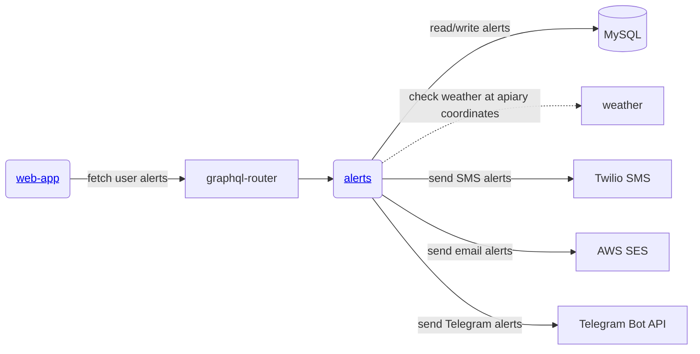
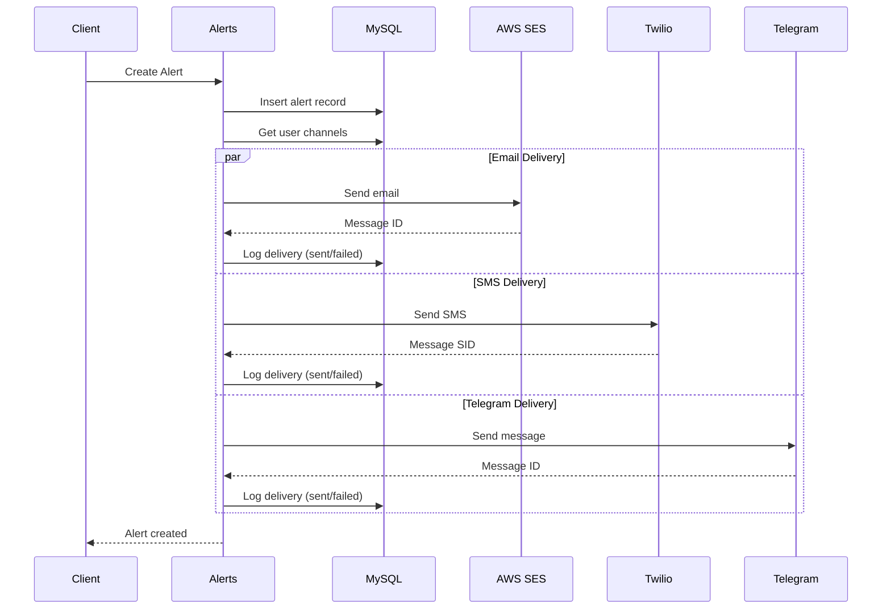

# Alerts Microservice

Gratheon.com alerts service - a multi-channel notification system responsible for:
- Managing user alerts and notifications
- Delivering alerts via SMS, Email, and Telegram
- User-defined alert rules based on hive metrics
- Multi-channel delivery with retry mechanism and comprehensive logging

## Table of Contents
- [Features](#features)
- [URLs](#urls)
- [Database Schema](#database-schema)
- [GraphQL API](#graphql-api)
- [Notification Channels](#notification-channels)
- [Alert Rules](#alert-rules)
- [Development](#development)
- [Configuration](#configuration)
- [Testing](#testing)
- [Architecture](#architecture)

## Features

### Core Functionality
- **Alert Management**: Create, read, and track user alerts
- **Multi-Channel Delivery**: Send alerts via SMS (Twilio), Email (AWS SES), and Telegram
- **Channel Configuration**: Users can configure notification preferences per channel
- **Time-Based Delivery**: Respect user-defined time windows for notifications
- **Alert Rules**: User-defined automated alerts based on hive metrics and thresholds
- **Delivery Tracking**: Comprehensive logging of delivery status per channel
- **Retry Mechanism**: Automatic retry of failed deliveries (up to 3 attempts)
- **Federation Support**: Apollo GraphQL Federation subgraph

### Supported Channels
1. **SMS** - Twilio integration with E.164 phone format
2. **Email** - AWS SES with plain text support
3. **Telegram** - Bot API with username and chat ID support

## URLs

| Environment | URL                             |
| ----------- | ------------------------------- |
| Local       | http://localhost:4560           |
| Production  | Internal service (port 4560)    |

## Database Schema

### Tables Overview

#### 1. `alerts`
Stores alert records for users with delivery tracking.

```sql
CREATE TABLE alerts (
  id INT AUTO_INCREMENT PRIMARY KEY,
  user_id INT NOT NULL,
  text TEXT NOT NULL,
  date_added TIMESTAMP DEFAULT CURRENT_TIMESTAMP ON UPDATE CURRENT_TIMESTAMP,
  alert_rule_id INT NULL,
  hive_id VARCHAR(50) NULL,
  metric_type VARCHAR(50) NULL,
  metric_value DECIMAL(10, 2) NULL,
  delivered BOOLEAN DEFAULT FALSE,
  delivery_attempts INT DEFAULT 0,
  
  INDEX idx_alert_rule (alert_rule_id),
  INDEX idx_delivered (delivered)
);
```

**Key Fields**:
- `alert_rule_id`: Links to automated alert rules (nullable for manual alerts)
- `hive_id`: Associated hive for metric-based alerts
- `metric_type`: Type of metric that triggered the alert (e.g., temperature, weight)
- `delivered`: Overall delivery status (deprecated - use alert_delivery_log)
- `delivery_attempts`: Number of delivery attempts (deprecated)

#### 2. `alert_channel_config`
User notification channel configurations.

```sql
CREATE TABLE alert_channel_config (
  id INT AUTO_INCREMENT PRIMARY KEY,
  user_id INT NOT NULL,
  channel_type VARCHAR(32) NOT NULL DEFAULT 'SMS',
  phone_number VARCHAR(32),
  email VARCHAR(255) NULL,
  telegram_username VARCHAR(255) NULL,
  telegram_chat_id BIGINT NULL,
  time_start VARCHAR(5),  -- e.g., '09:00'
  time_end VARCHAR(5),    -- e.g., '18:00'
  enabled BOOLEAN DEFAULT TRUE,
  
  UNIQUE KEY (user_id, channel_type),
  INDEX idx_user_channel (user_id, channel_type),
  INDEX idx_telegram_chat_id (telegram_chat_id)
);
```

**Supported Channel Types**: `SMS`, `EMAIL`, `TELEGRAM`

**Key Fields**:
- `telegram_chat_id`: Required for reliable Telegram delivery (obtained when user starts bot)
- `time_start/time_end`: Quiet hours - alerts only sent within this window

#### 3. `alert_rules`
User-defined rules for automated alerts.

```sql
CREATE TABLE alert_rules (
  id INT AUTO_INCREMENT PRIMARY KEY,
  user_id INT NOT NULL,
  hive_id VARCHAR(50) NULL,
  apiary_id VARCHAR(50) NULL,
  metric_type VARCHAR(50) NOT NULL,
  condition_type VARCHAR(20) NOT NULL,
  threshold_value DECIMAL(10, 2) NOT NULL,
  duration_minutes INT NOT NULL DEFAULT 60,
  enabled BOOLEAN DEFAULT TRUE,
  created_at TIMESTAMP DEFAULT CURRENT_TIMESTAMP,
  updated_at TIMESTAMP DEFAULT CURRENT_TIMESTAMP ON UPDATE CURRENT_TIMESTAMP,
  
  INDEX idx_user_hive (user_id, hive_id),
  INDEX idx_apiary (apiary_id),
  INDEX idx_enabled (enabled)
);
```

**Key Fields**:
- `condition_type`: Comparison operator (e.g., `>`, `<`, `>=`, `<=`, `==`)
- `threshold_value`: Metric value threshold that triggers the alert
- `duration_minutes`: Time window for condition evaluation
- `apiary_id`: Apply rule to all hives in apiary (if `hive_id` is null)

#### 4. `alert_delivery_log`
Per-channel delivery tracking for comprehensive auditing.

```sql
CREATE TABLE alert_delivery_log (
  id INT AUTO_INCREMENT PRIMARY KEY,
  alert_id INT NOT NULL,
  user_id INT NOT NULL,
  channel_type VARCHAR(32) NOT NULL,
  delivery_status ENUM('pending', 'sent', 'failed') DEFAULT 'pending',
  delivery_time TIMESTAMP NULL,
  error_message TEXT NULL,
  external_message_id VARCHAR(255) NULL,  -- MessageId from SES, MessageSid from Twilio, etc.
  retry_count INT DEFAULT 0,
  created_at TIMESTAMP DEFAULT CURRENT_TIMESTAMP,
  updated_at TIMESTAMP DEFAULT CURRENT_TIMESTAMP ON UPDATE CURRENT_TIMESTAMP,
  
  INDEX idx_alert_id (alert_id),
  INDEX idx_user_channel (user_id, channel_type),
  INDEX idx_status (delivery_status),
  FOREIGN KEY (alert_id) REFERENCES alerts(id) ON DELETE CASCADE
);
```

**Key Features**:
- Independent tracking per channel (one record per alert per channel)
- External message IDs for reconciliation with delivery providers
- Retry tracking with error messages
- Cascading delete when alert is removed

## GraphQL API

### Queries

```graphql
type Query {
  # Get all alerts for current user (last 100, ordered by date)
  alerts: [Alert]
  
  # Get user's channel configurations
  alertChannels: [AlertChannel]
  
  # Get alert rules with optional filtering
  alertRules(hiveId: String, metricType: String): [AlertRule]
}
```

### Mutations

```graphql
type Mutation {
  # Configure or update a notification channel
  setAlertChannel(config: AlertChannelInput!): AlertChannel
  
  # Remove a notification channel
  deleteAlertChannel(channelType: String!): Boolean
  
  # Create a new alert rule
  createAlertRule(rule: AlertRuleInput!): AlertRule
  
  # Update existing alert rule
  updateAlertRule(id: ID!, rule: AlertRuleInput!): AlertRule
  
  # Delete alert rule
  deleteAlertRule(id: ID!): Boolean
}
```

### Types

```graphql
type Alert {
  id: ID!
  user_id: Int!
  text: String!
  date_added: String!
  alert_rule_id: Int
  hive_id: String
  metric_type: String
  metric_value: Float
  delivered: Boolean
  delivery_attempts: Int
}

type AlertChannel {
  id: ID!
  user_id: Int!
  channel_type: String!
  phone_number: String
  email: String
  telegram_username: String
  telegram_chat_id: String
  time_start: String
  time_end: String
  enabled: Boolean!
}

type AlertRule {
  id: ID!
  user_id: Int!
  hive_id: String
  apiary_id: String
  metric_type: String!
  condition_type: String!
  threshold_value: Float!
  duration_minutes: Int!
  enabled: Boolean!
  created_at: String!
  updated_at: String!
}
```

See `schema.graphql` for complete schema definition.

## Notification Channels

### Email Delivery (AWS SES)
- **Implementation**: `src/delivery/email.ts`
- **Integration**: AWS SDK v3 (@aws-sdk/client-ses)
- **From Address**: Configurable (default: pilot@gratheon.com)
- **Format**: Plain text
- **Returns**: SES Message ID for tracking

**Configuration Required**:
```typescript
aws: {
  region: 'eu-west-1',
  accessKeyId: string,
  secretAccessKey: string,
  sesFromEmail: string
}
```

### SMS Delivery (Twilio)
- **Implementation**: `src/delivery/sms.ts`
- **Integration**: Twilio Node SDK
- **Phone Format**: E.164 (e.g., +14155552671)
- **Service**: Twilio Messaging Service
- **Returns**: Twilio Message SID for tracking

**Configuration Required**:
```typescript
twilio: {
  accountSid: string,
  authToken: string,
  messagingServiceSid: string
}
```

### Telegram Delivery
- **Implementation**: `src/delivery/telegram.ts`
- **Integration**: node-telegram-bot-api
- **Delivery Methods**:
  1. By username (requires user to `/start` bot first)
  2. By chat ID (preferred - more reliable)
- **Returns**: Telegram message ID

**Configuration Required**:
```typescript
telegram: {
  botToken: string
}
```

**Note**: Users must start the Telegram bot to receive messages. Chat ID is captured on first interaction.

## Alert Rules

Alert rules enable automated notifications based on hive metrics.

### Rule Components
- **Metric Type**: The sensor/metric to monitor (e.g., temperature, weight, humidity)
- **Condition**: Comparison operator (`>`, `<`, `>=`, `<=`, `==`)
- **Threshold**: Value that triggers the alert
- **Duration**: Time window for evaluation (in minutes)
- **Scope**: Specific hive or entire apiary

### Example Use Cases
1. **Temperature Alert**: Notify if hive temperature > 35°C for 60 minutes
2. **Weight Drop**: Alert if hive weight decreases > 5kg in 24 hours
3. **Humidity Warning**: Notify if humidity < 40% for 2 hours
4. **Apiary-wide**: Monitor all hives in apiary for critical conditions

### Rule Evaluation
- **Implementation**: `src/models/alertEvaluator.ts`
- **Status**: Evaluation logic is placeholder (to be implemented)
- **Flow**: Rules → Metrics → Evaluate → Create Alert → Multi-Channel Delivery

## Development

### Prerequisites
- [nvm](https://github.com/nvm-sh/nvm) - Node Version Manager
- [just](https://github.com/casey/just) - Command runner
- Docker & Docker Compose
- MySQL 8.0+

### Quick Start

```bash
# Start service with Docker
just start

# Run locally in development mode
just run

# Run tests
just test
```

### Available Commands (justfile)

```bash
just start              # Build and start in Docker
just run                # Run locally in dev mode
just test               # Run all tests
just test-unit          # Run unit tests only
just test-integration   # Run integration tests
just test-manual        # Run manual channel tests (requires real credentials)
just test-docker        # Run tests in Docker
```

### NPM Scripts

```bash
npm run build           # Compile TypeScript
npm run dev             # Development mode with hot reload
npm start               # Production mode
npm test                # All tests
npm run test:unit       # Unit tests
npm run test:integration # Integration tests
npm run test:manual     # Manual tests (email, SMS, Telegram)
```

### API Endpoints

| Method | URL          | Description             |
| ------ | ------------ | ----------------------- |
| GET    | /            | HTML documentation page |
| GET    | /health      | Health check endpoint   |
| POST   | /graphql     | GraphQL API             |

## Configuration

Configuration is managed through TypeScript config files:
- `src/config/config.default.ts` - Default values
- `src/config/config.dev.ts` - Development overrides
- `src/config/index.ts` - Config loader

### Environment Variables

Set `ENV_ID` to load environment-specific config:
- `dev` - Development
- `prod` - Production

### Required Configuration

```typescript
{
  // Service URLs
  schemaRegistryHost: string,  // GraphQL schema registry
  selfUrl: string,              // This service URL for federation

  // Database
  mysql: {
    host: string,
    port: string,
    user: string,
    password: string,
    database: string
  },

  // Authentication
  JWT_KEY: string,

  // Twilio SMS
  twilio: {
    accountSid: string,
    authToken: string,
    messagingServiceSid: string
  },

  // AWS SES Email
  aws: {
    region: string,
    accessKeyId: string,
    secretAccessKey: string,
    sesFromEmail: string
  },

  // Telegram Bot
  telegram: {
    botToken: string
  }
}
```

## Testing

### Test Structure
- **Unit Tests**: `test/unit/` - Isolated component tests
- **Integration Tests**: `test/integration/` - API and cross-service tests
- **Manual Tests**: `test/manual-tests/` - Real delivery channel tests (require credentials)

### Integration Tests
Tests include:
- GraphQL API endpoint validation
- Cross-channel delivery reliability
- End-to-end alert delivery flow
- Configuration management

### Manual Tests
Test actual delivery channels (requires valid credentials):
- Email delivery via AWS SES
- SMS delivery via Twilio
- Telegram message delivery

**Run manual tests**:
```bash
just test-manual
```

## Architecture

### System Context



### Multi-Channel Delivery Flow



### Key Components

**Service Layer** (`src/alerts.ts`):
- Fastify HTTP server
- Apollo Server GraphQL Federation subgraph
- Schema registration with central registry

**Models** (`src/models/`):
- `alerts.ts` - Alert CRUD operations
- `alertChannel.ts` - Channel configuration management
- `alertRule.ts` - Rule CRUD operations
- `alertEvaluator.ts` - Rule evaluation and multi-channel delivery orchestration
- `alertDeliveryLog.ts` - Delivery tracking and retry logic

**Delivery Channels** (`src/delivery/`):
- `email.ts` - AWS SES integration
- `sms.ts` - Twilio integration
- `telegram.ts` - Telegram Bot API integration

**Database** (`src/storage.ts`):
- MySQL connection pooling
- Automated migrations with hash-based tracking
- Migration files in `migrations/` directory

### Migration Management

Migrations are automatically applied on service startup:
- Hash-based tracking prevents duplicate execution
- Sequential execution with transactions
- Migration table: `_db_migrations`

Add new migrations by creating SQL files in `migrations/` directory with sequential numbering.

## Future Roadmap

- [ ] Weather alerts reporting for specific apiaries
- [ ] Rule evaluation engine for automated alerts
- [ ] Advanced notification scheduling
- [ ] Alert aggregation and batching
- [ ] Rich HTML email templates
- [ ] Push notification support
- [ ] Alert history and analytics
- [ ] Multi-language support for notifications

## License

Dual-licensed under AGPL and Commercial licenses. See LICENSE files for details.
