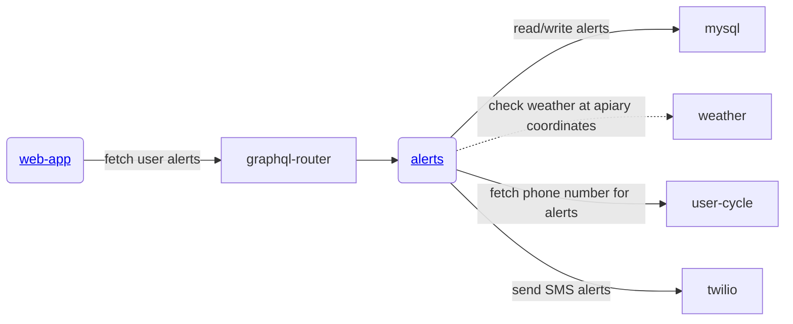

# alerts

Gratheon.com alerts service, responsible for:
- showing generated alerts in the UI (web-app)

TODO
- weather alerts reporting for a specific apiary
- alert channel configuration by the user
- SMS alerts
- email alerts


## URLs

| Environment | URL                             |
| ----------- | ------------------------------- |
| Local       | http://localhost:4560           |

## Development

To run, you need [nvm](https://github.com/nvm-sh/nvm) and [just](https://github.com/casey/just):

```
just start
```

### API

| Method | URL          | Description             |
| ------ | ------------ | ----------------------- |
| POST   | /graphql     | GraphQL API             |
| GET    | /health      | Health check            |

## Architecture


